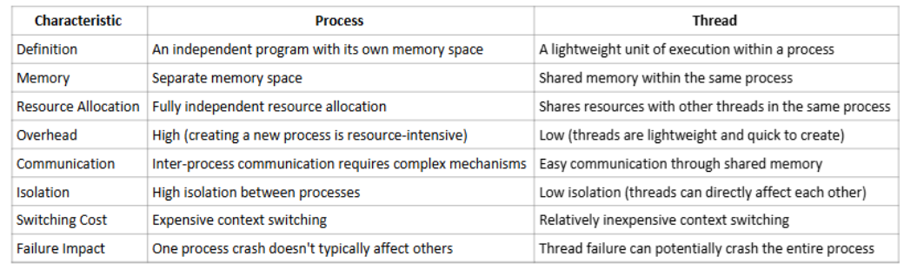
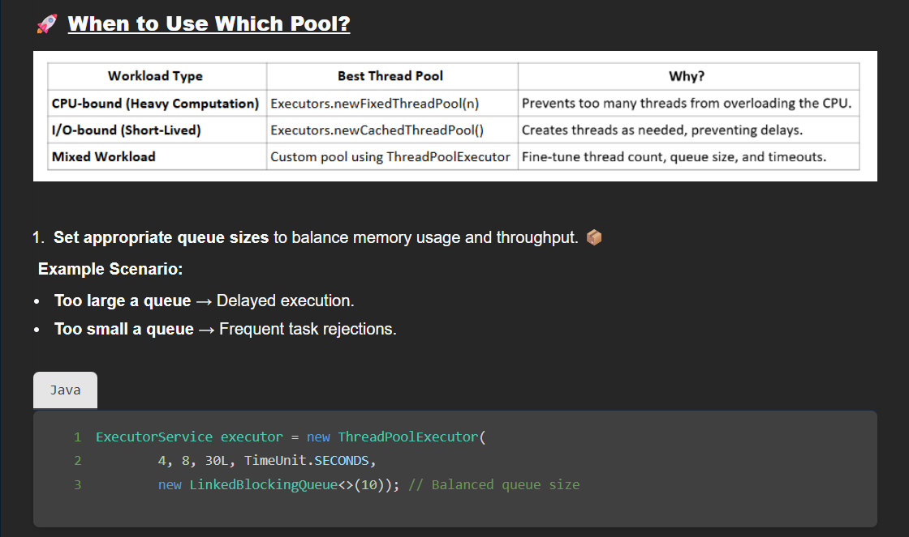

https://youtu.be/Rot2QnaUqBU

4 cores - at a specific point in time only 4 threads can run
does it mean only 4 tasks can run parallely? more than 4 can run on 4 cores because of virtualisation

Parallelism	4 threads running simultaneously on 4 cores
Concurrency	10+ threads getting CPU time by rapid switching

3 ways to create threads
1) extending Thread class and override run()
drawback - cannot extend any other class (multiple inheritance not supported by Java)

    MyThread thread = new MyThread();
    thread.start();

2) implementing Runnable and override run()

   class MyRunnable implements Runnable {}

    MyRunnable runnable = new MyRunnable();
    Thread thread = new Thread(runnable);
    thread.start();

    new Thread(() -> {
    // code to run in thread
    }).start();

3) implementaing Callable<returnType> and override (call() : returnType)

- unlike Runnable (void run()), Callable (call()) can return results and throw checked exceptions
- Callable works with `ExecutorService` and `Future` objects to retrieve results after task completion

    class MyCallable implements Callable<String> { 
     
        private final String name; 
     
        public MyCallable(String name) { 
           this.name = name; 
        } 
     
        @Override 
        public String call() throws Exception { 
            //some code
        } 
    } 

    ExecutorService executor = Executors.newFixedThreadPool(2); 
         
    Callable<String> callable1 = new MyCallable("Task 1"); 
    Callable<String> callable2 = new MyCallable("Task 2"); 
          
    Future<String> future1 = executor.submit(callable1); 
    Future<String> future2 = executor.submit(callable2); 

    future1.get(); // main thread is blocked until we get result of thread - Task 1 in future1

-------------------------------------------------------------------------------------------------------------------------------------------------------------------------

Checked vs Unchecked Exceptions

Checked - checked at compile time; require explicit handling through `throws` or try-catch. Ex: SQLException, IOException, ParseException, InterruptedException
Unchecked - occurs due to logical errors in the program. Ex: NPE, ArrayIndexOutOfBoundsException

Best Practices for Thread Implementation 
- Use Runnable over Thread extension when possible for better design principles
- Keep synchronization minimal to avoid performance bottlenecks
- Handle interruptions properly to ensure graceful thread termination
- Avoid thread starvation by balancing priorities and resource allocation
- Use higher-level concurrency utilities from java.util.concurrent package for complex scenarios

Interview questions
1) Diff b/w start(), run()
- start() creates a new thread then calls run()
- run() does not create a new thread and executes in current thread

 main () {
    MyThread t1 = new MyThread();
    t1.start(); // starts a new thread

    MyThread t2 = new MyThread();
    t2.run(); // runs in main thread
}

2) Can start() be called twice on the same thread?
- No. Doing so will give IllegalThreadStateException
- IMP: A thread that has completed execution cannot be restarted

3) How can thread safety be achieved?
- 5 ways
   1. synchronization
   2. immutable objects
   3. concurrent collections
   4. atomic variables
   5. thread-local variables

4) What happens if an execption occurs in a thread's run method?
- If started with thread.start(), an uncaught exception terminates only that thread; it doesn't affect the main or other threads
- If thread.run() is called directly, it runs in the current thread (e.g., main thread), so an uncaught exception can terminate that thread

5) Diff b/w sleep() and wait()

| Feature                                   | `sleep()`                   | `wait()`                                       |
| ----------------------------------------- | --------------------------- | ---------------------------------------------- |
| Defined in                                | `Thread` class              | `Object` class                                 |
| Lock handling                             | Doesn’t release the lock    | Releases the lock while waiting                |
| Used for                                  | Pausing a thread for a time | Thread communication (e.g., producer-consumer) |
| Syntax                                    | `Thread.sleep(ms)`          | `obj.wait()`                                   |

6) What happens to the idle thread once notify() or notifyAll() is called?

- One or all waiting threads (respectively) are moved from the waiting state to the runnable state
- However, they don’t immediately run — they must first reacquire the object's lock
- Once the lock is available and acquired, the thread resumes execution from where it called wait()

7) Can you use Callable with standard Thread objects? 
- No, you cannot directly use Callable with the Thread class. Callable is designed to work with the ExecutorService framework. Thread class only accepts Runnable objects. However, you can adapt a Callable to work with Thread by creating a Runnable that executes the Callable and stores its result: 

class MyRunnable implements Runnable { 
    private Callable<Integer> callable; 
    public MyRunnable(Callable<Integer> callable) { 
        this.callable = callable; 
    } 
 
    public void run() { 
        try { 
            System.out.println(callable.call()); 
        } catch (Exception e) { 
            e.printStackTrace(); 
        } 
    } 
}

-------------------------------------------------------------------------------------------------------------------------------------------------------------------------
Thread Lifecycle
1) New
2) Runnable (when start() is invoked from New state) --> Running
3) Timed Waiting (when sleep() invoked)/ Waiting/ Blocked
4) Terminated

Runnable - ready for execution/ waiting for CPU allocation
Blocked - trying to enter CS but it was already locked
Waiting - waiting for some other thread to perform specific action; entered via methods like Object.wait(), Thread.join()

-------------------------------------------------------------------------------------------------------------------------------------------------------------------------
Thread Pool - collection of REUSABLE threads

    // Create a fixed thread pool with 3 threads 
    ExecutorService executorService = Executors.newFixedThreadPool(3); 

    // Submit a task to the thread pool 
    executorService.submit(new WorkerThread(i)); 
    
 
    // Shutdown the executor service 
    executorService.shutdown(); 

-------------------------------------------------------------------------------------------------------------------------------------------------------------------------
Thread Pool Lifecycle

1. Pool Creation: When a thread pool is created, it may pre-create some threads (aka core threads) in the NEW state and immediately start them to RUNNABLE
2. Task Execution: When a task is submitted: 

An idle thread in the pool executes the task 
The thread's state changes according to task operations (RUNNABLE, RUNNING, BLOCKED, WAITING, etc.) 
After task completion, the thread returns to the pool (RUNNABLE state waiting for next task) 

3. Pool Shutdown: During shutdown, threads complete their current tasks and are eventually terminated

-------------------------------------------------------------------------------------------------------------------------------------------------------------------------
Thread Lifecycle Management

1. Handle Interrupted Exception properly to allow clean thread termination

catch (InterruptedException e) { 
            Thread.currentThread().interrupt(); 
}
catching because the compiler requires it
re-interrupting to let someone else know and accordingly handle the interruption properly

2. Avoid thread leaks by ensuring threads don't get stuck in WAITING or BLOCKED states. Use timeouts

class SafeLock { 
    private final Object lock = new Object(); 
 
    void waitForSignal() { 
        synchronized (lock) { 
            try { 
                System.out.println(Thread.currentThread().getName() + " is waiting..."); 
                lock.wait(3000); // Wait with a timeout to prevent leak 
            } catch (InterruptedException e) { 
                Thread.currentThread().interrupt(); 
            } 
        } 
    } 
} 
 
public class ThreadLeakExample { 
    public static void main(String[] args) { 
        SafeLock safeLock = new SafeLock(); 
        new Thread(safeLock::waitForSignal, "WorkerThread").start(); 
    } 
}

-------------------------------------------------------------------------------------------------------------------------------------------------------------------------
Thread Pool Types

1. newFixedThreadPool(count) - used when more of CPU bound operations
- threads exist for the lifetime of the executor, even if they are idle

private static final int NUM_CORES = Runtime.getRuntime().availableProcessors();
ExecutorService fixedPool = Executors.newFixedThreadPool(NUM_CORES);

2. newCachedThreadPool - used when more of I/O bound operations; or for short lived tasks
  - unlike newFixedThreadPool new threads are created as and when needed; idle threads are ofcourse reused before creating a new one
  - unlike newFixedThreadPool idle threads are reclaimed after a period of inactivity
  - used in Pub Sub Design https://github.com/AshuOPragmatikosThrylos/LLD-Problems/blob/main/14.%20Pub%20Sub%20or%20Messaging%20Queue%20(Hard)/code/controllers/KafkaController.java

3. newSingleThreadExecutor
  - used in Cache Design
  - used to execute tasks sequentially, in the exact order they are submitted. So will have to call this newSingleThreadExecutor() again and again if we want multiple threads
  - usecase: when order has to maintained for some logging purpose

Interview questions
1. Why newCachedThreadPool() is often better for I/O bound tasks than newFixedThreadPool()?
- cuz newCachedThreadPool() can create more threads as needed, reducing idle wait time during I/O blocking

2. Why newFixedThreadPool() might be less ideal for I/O bound tasks?
- limited threads may stay blocked, reducing throughput
- Adding too many threads causes frequent context switching—CPU keeps swapping thread states to give every runnable thread a chance, wasting time

3. For mix of I/O and CPU intensive tasks, use ThreadPoolExecutor instead

ExecutorService executor = new ThreadPoolExecutor(
    2,                                  // corePoolSize - Minimum number of threads to keep alive, even if idle
    4,                                  // maximumPoolSize
    10,                                 // keepAliveTime - Time to keep extra (non-core) threads alive when idle
    TimeUnit.SECONDS,                   // Time unit for keepAliveTime
    new LinkedBlockingQueue<Runnable>() // Queue to hold tasks before they're executed. E.g., LinkedBlockingQueue, ArrayBlockingQueue
);

ThreadPoolExecutor executor = new ThreadPoolExecutor(
    corePoolSize,      // Minimum number of threads to keep alive
    maximumPoolSize,   // Maximum number of threads allowed
    keepAliveTime,     // Time to keep non-core threads alive when idle
    timeUnit,          // Unit for keepAliveTime
    workQueue,         // Queue for holding tasks before execution
    threadFactory,     // Factory for creating new threads
    rejectionHandler   // Handler for rejected tasks
);

- How It Works Internally
  * If current threads < corePoolSize → a new thread is created
  * Else if the queue isn’t full → task goes into the queue
  * Else if current threads < maximumPoolSize → new thread created
  * Else → task is rejected (based on RejectedExecutionHandler)

4. How does a thread pool executor queue size affect its behavior?
- more queue size => can hold more pending tasks => new threads are spawned only after queue is full => delayed execution for those added in queue at the last
- less queue size - frequent task rejections

5. What is the diff b/w shutdown() and shutdownNow()?
- `shutdown()` – **Gracefully** stops accepting new tasks and lets running/pending ones finish
- `shutdownNow()` – **Forcibly** tries to stop all tasks immediately and returns a list of queued (awaiting execution) tasks

    - List<Runnable> pendingTasks = executor.shutdownNow();

6. Can a thread in TIMED_WAITING state move directly to TERMINATED state?
Yes. that's true for thread being in any state

7. What is thread starvation and how thread pools can help prevent it?
- thread starvation  - thread is unable to get access to the shared resources of the process
- thread pools can prevent starvation by
  * controlling the number of active threads
  * implementing fair scheduling policies (so that high priority threads are NOT favored by the OS scheduler)

-------------------------------------------------------------------------------------------------------------------------------------------------------------------------
Thread Executors

ScheduledExecutorService scheduler = Executors.newScheduledThreadPool(1);
scheduler.schedule(() -> {
    System.out.println("Executed after 3 seconds!");
}, 3, TimeUnit.SECONDS);
‍
- can delay task execution or schedule it periodically - useful for cron-like jobs or time-based tasks
- If the task throws an exception, it won’t run again

ScheduledExecutorService scheduler = Executors.newScheduledThreadPool(1);
scheduler.scheduleAtFixedRate(() -> {
    System.out.println("Running every 2 seconds");
}, 0, 2, TimeUnit.SECONDS); // initialDelay, period

- allows you to schedule tasks to run after a delay or at a fixed rate - ideal for repeated jobs like health checks or polling
- If a task throws an exception, it stops future executions
- If a task takes longer than the rate interval, it may overlap (depending on thread pool size)

Monitoring using Thread Executors
- executor.getActiveCount()
- executor.getQueue().size()

- Executor interface
- ExecutorService interface extends Executor
- ThreadPoolExecutor implements ExecutorService
- ScheduledThreadPoolExecutor implements ScheduledExecutorService

ScheduledThreadPoolExecutor scheduledPool = new ScheduledThreadPoolExecutor(1);
scheduledPool.schedule(() -> System.out.println("Scheduled once"), 5, TimeUnit.SECONDS);

- Executors: Factory class for creating executor instances

ExecutorService fixedPool = Executors.newFixedThreadPool(3);
ScheduledExecutorService scheduled = Executors.newScheduledThreadPool(1);

-------------------------------------------------------------------------------------------------------------------------------------------------------------------------
Essential Methods of ExecutorService 

execute() vs submit()

executor.execute(() -> System.out.println("Task executed"));
  - accepts only Runnable
  - returns nothing

Future<String> future = executor.submit(() -> "Hello from Callable");
  - accepts Runnable or Callable
  - returns Future
  - can block and get the result using future.get()
  - If the task fails (e.g., throws an exception), future.get() will throw ExecutionException.
  - You can still check future.isCancelled() or future.isDone()

List<Future<String>> results = executor.invokeAll(tasks);
List<Future<String>> timeoutResults = executor.invokeAll(allTasks, 1, TimeUnit.SECONDS); // can mention timeout (optional)
- Runs all tasks in parallel
- Waits until all finish
- You get a list of Futures
- If one task fails, its Future will throw an exception on get(), but others keep running

Interview questions
1. How does ThreadPoolExecutor decide whether to create a new thread or queue a task?
  * If current threads < corePoolSize → a new thread is created
  * Else if the queue isn’t full → task goes into the queue
  * Else if current threads < maximumPoolSize → new thread created
  * Else → task is rejected (based on RejectedExecutionHandler)

2. What happens if we don't explicitly shutdown an ExecutorService?
 - threads will keep running - waste of resources
 - might lead to memory leak and eventually resource exhausation

3. Diff b/w scheduleAtFixedRate() and scheduleWithFixedDelay() ?
* `scheduleAtFixedRate`: Runs tasks at a fixed rate; may **overlap** if a task runs long
* `scheduleWithFixedDelay`: Runs tasks with a fixed **delay after each completes**; no overlap

4. How can you handle exceptions thrown by tasks submitted to an ExecutorService?
submit()	Use Future.get() to catch exception

try {
    future.get(); // This will throw ExecutionException
} catch (ExecutionException e) {
    System.out.println("Caught: " + e.getCause());
}

-------------------------------------------------------------------------------------------------------------------------------------------------------------------------
Thread Synchronization

1. synchronized method
- Declaring a method as synchronized locks the object (or class for static methods) before execution and releases it after the method completes

2) synchronized block
- Use a `synchronized` block instead of a method when only part of the code needs locking—this lets other threads run non-critical code without waiting
- used in Pub Sub design

public class CounterSyncBlock { 
    private int count = 0; 

    private final Object lock = new Object(); 

    public void increment() { 
        // Non-critical part: runs without locking. 
        System.out.println("Non-Synchronized part (pre-processing): " + Thread.currentThread().getName()); 

        // Critical section: only this part is synchronized. 
        synchronized (lock) { // any object can be used as a lock
            System.out.println("Synchronized Block - Start increment: " + Thread.currentThread().getName()); 
            count++; 
            System.out.println("Synchronized Block - Counter value after increment: " + count); 
            System.out.println("Synchronized Block - End increment: " + Thread.currentThread().getName()); 
        } 

        // Non-critical part: runs after the synchronized block. 
        System.out.println("Non-Synchronized part (post-processing): " + Thread.currentThread().getName()); 
    } 
}

Volatile
- A `volatile` variable is always read from and written to main memory, ensuring updates by one thread are instantly visible to others
- Operations on a volatile variable cannot be re-ordered relative to each other
- Use Cases
   * Flags & Status Signals (e.g., shutdown flags)
   * Double-Checked Locking in singletons https://github.com/AshuOPragmatikosThrylos/Design-Patterns-Practice/blob/master/08.%20Singleton/Better%20Code/Singleton.java

Atomic
- Atomic variables offer 
   - simple, lock-free, thread-safe operations 
   - on single variables (not part of complex objects)
   - using CAS (Compare-And-Swap) under the hood
- uses Compare-And-Swap (CAS) at the JVM level via Unsafe class
- CAS retries if the variable was modified in the meantime
- Lock-free operations are non-blocking, allowing threads to proceed without waiting, thereby eliminating the risk of deadlock

Instead of 

synchronized(lock) {
   count++;
}

below can be used

AtomicInteger count = new AtomicInteger(0);
count.incrementAndGet();

| Class                | For                                    |
| -------------------- | -------------------------------------- |
| `AtomicInteger`      | Atomic operations on int               |
| `AtomicLong`         | Atomic operations on long              |
| `AtomicBoolean`      | Atomic operations on boolean           |
| `AtomicReference<T>` | Atomic operations on object references |
| `AtomicIntegerArray` | For int arrays                         |

get()
set(x)
getAndIncrement() / incrementAndGet()
getAndAdd(x) / addAndGet(x)

-------------------------------------------------------------------------------------------------------------------------------------------------------------------------
Thread Communication

- Use notify() when only one waiting thread needs to be awakened 
- wait(), notify(), and notifyAll() must be called inside a synchronized block/method on the same object
- Threads typically wait in a loop, checking a shared condition to handle spurious wakeups
- IMP: Spurious wakeups are unexpected returns from wait() (due to JVM/OS optimizations), so threads must check conditions in a loop 

synchronized (lock) {
    while (!condition) {  // re-check the condition
        lock.wait();
    }
}

Interview questions
1. Can you explain the producer-consumer problem and how to solve it using thread communication? 
- A shared bounded buffer (or queue) is used to store the items. The challenge is to coordinate the producer and consumer so that:
    * The producer waits when the buffer is full (to avoid overfilling)
    * The consumer waits when the buffer is empty (to avoid consuming a non-existent item)
- Inter-thread communication methods—wait(), notify(), and notifyAll()—are used to achieve this coordination

-------------------------------------------------------------------------------------------------------------------------------------------------------------------------
Locks

#### **1. Why Use Locks?**

* **`synchronized`** is simple but has limitations: no timeout, no try-lock, no interruptible waits
* `java.util.concurrent.locks.Lock` provides **more control** over locking.

---

#### **2. Lock Interface (java.util.concurrent.locks.Lock)**

Key methods:

lock();                      // Blocks until lock acquired
unlock();                    // Releases the lock
tryLock();                   // checks availability and acquires the lock only if it's free, without blocking otherwise returns false
tryLock(timeout, unit);      // Waits up to timeout
lockInterruptibly();         // Can respond to interrupt

---

#### **3. ReentrantLock**

* Most common Lock implementation.
* **Reentrant**: 
   - thread can reacquire the same lock multiple times
   - essential for nested method calls or recursion that use the same lock
   - without reentrancy, a thread would deadlock itself if it tries to reacquire a lock it already holds

General Definition of Deadlock:
Deadlock occurs when two or more threads are waiting on each other in a cycle, and none can proceed.

Example of classic deadlock:
Thread A holds Lock 1 and waits for Lock 2
Thread B holds Lock 2 and waits for Lock 1
This forms a cycle → neither can proceed.

What Happens in Self-Deadlock (Non-reentrant locks)?
A single thread holds a non-reentrant lock
It tries to acquire the same lock again (e.g., via a nested method call)
Since the lock doesn't know it's the same thread, it blocks — waiting on itself

So technically, this is a special case of deadlock, but not a cyclic one between multiple threads.

* Supports **fairness** (`new ReentrantLock(true)`): longest-waiting thread gets the lock.

Example:

Lock lock = new ReentrantLock();

lock.lock();
try {
   // critical section
} finally {
   lock.unlock(); // IMP: Always unlock in finally block
}

---

#### **4. ReentrantReadWriteLock**

* Improves concurrency when reads are more frequent than writes.
* Allows:

  * Multiple **read locks** at the same time
  * Only **one write lock**, and no read locks during write

ReentrantReadWriteLock rwLock = new ReentrantReadWriteLock();
Lock readLock = rwLock.readLock();
Lock writeLock = rwLock.writeLock();

---

#### 📏 **5. Lock vs synchronized**

| Feature               | `synchronized` | `Lock`                        |
| --------------------- | -------------- | ----------------------------- |
| Reentrant             | ✅ Yes          | ✅ Yes                         |
| Fairness              | ❌ No           | ✅ Optional                    |
| Try without blocking  | ❌ No           | ✅ Yes (`tryLock()`)           |
| Interruptible         | ❌ No           | ✅ Yes (`lockInterruptibly()`) |
| Timeout               | ❌ No           | ✅ Yes (`tryLock(timeout)`)    |
| Read/Write separation | ❌ No           | ✅ With `ReadWriteLock`        |

* **synchronized**: Lock is auto-released when the block exits, even on exceptions
* **ReentrantLock**: Must manually call `unlock()`

---

#### **6. Common Mistakes**

* **Forgetting `unlock()`** → can cause deadlock. Always use in `finally`.
* **Locking order inconsistency** → leads to deadlocks between threads.

---

#### **7. Best Practices**

* Prefer `ReentrantLock` if you need:

  * Timeout
  * Interruptibility
  * Explicit control
* Use `synchronized` when possible for simplicity.
* Use `ReentrantReadWriteLock` for heavy-read scenarios.

-------------------------------------------------------------------------------------------------------------------------------------------------------------------------
Semaphore

Lock --> exclusive access of Critical Section to only 1 thread
Semaphore --> 1 or more (aka count of permits)

acquire() --> decrement count of permits
release() --> increment count of permits
availablePermits() --> returns count of permits

If no permits are available, a thread trying to acquire one will block until a permit is released or the thread is interrupted

Use case of semaphores
1. resource pools (DB connection pool, thread pool etc)
2. how many files can get downloaded at once in browser
3. rate limiting API calls

Binary semaphore/mutex, lock --> all 3 are one and the same --> all 3 give mutually exclusive access to the CS

Semaphore mutex = new Semaphore(1);
mutex.acquire(); 
mutex.release();

Counting Semaphore/ Semaphore
Semaphore resourcePool = new Semaphore(3);

Binary semaphore/mutex is a speacial case of Counting Semaphore/ Semaphore

Interview questions (IMP)
1. What happens if a thread calls release() on a semaphore without first calling acquire()?
- yes can do that
- it increases the permit count, possibly beyond the initial value
- useful for dynamically increasing resources
- can cause unexpected behavior if misused (e.g., allowing too many threads)

2. Producer consumer problem using semaphore
3. barrier - ensures that no thread can proceed past a certain point until all threads have reached that point
4. readwritelock using semaphores
    - Multiple readers: Multiple threads can read simultaneously
    - Exclusive writers: Only one thread can write at a time
    - Mutual exclusion: When a writer is active, no readers are allowed
    - Coordination mechanism: First reader blocks writers, last reader unblocks them
-------------------------------------------------------------------------------------------------------------------------------------------------------------------------
Java Concurrent Collections

1. ConcurrentHashMap

**Concurrency Model**

   * Uses **finer-grained locking** (not locking the whole map)
   * Locks only the **first node of a bucket** during writes
   * Lock free reads (lock free achieved through CAS)
   * Uses optimistic locking and CAS (Compare And Swap) for rare structural changes like table initialization, resizing, and converting buckets to trees, enabling non-blocking coordination between threads

**Optimistic Locking**

   * Assumes data won't change while reading
   * Reads without locking → validates at the end → retries if needed
   * usually lock is pessimistic lock - if lock cannot be acquired then wait
   * Used in `ConcurrentHashMap` with **CAS** during structural reads like `size()`, `containsValue()`, or during resizing

**Why Most Reads Don’t Use Locks**

   * `get()` reads from a **volatile** variable
   * Locking/CAS only needed in rare structural cases (e.g. rehashing) 

**Node Immutability**

   * Each node contains **key**, **value**, and **next**
   * `key` and `next` are **immutable**; `value` is **mutable but volatile**
   * Volatile guarantees **visibility**, not **atomicity**
   * Operations like x++, put(), or remove() are not atomic

**Volatile vs Lock vs CAS**

   * `volatile`: A write to a volatile variable by one thread becomes visible to others immediately
   * `CAS`: supports non-blocking updates
   * Locks: used for more complex structural changes

**Iteration Requires Manual Locking**

   * `Collections.synchronizedMap()` synchronizes only **individual operations**, not compound ones (can be used to prevent manual locking of map)
   * even after wrapping in synchronizedMap while iterating over it we still have to lock/synchronize the hashmap
   * Iteration = compound operation (check + move + read) → **requires external synchronization** to avoid `ConcurrentModificationException`

**Comparison:**

   * `ConcurrentHashMap` is better than `synchronizedMap` because it **locks buckets**, not the entire map → **true concurrent access** for different keys

2. CopyOnWriteArrayList
- When a modification operation (add, remove, set) is performed, the entire array is copied to a new array with the modification applied, and the reference to the array is atomically updated to point to the new array
- Read operations (like get(), size(), contains()) operate on the original array reference without any locking, providing non-blocking reads
- Iterators created from the list work on a snapshot of the original array at the time the iterator was created, making them immune to concurrent modifications and eliminating the need to throw ConcurrentModificationException
- reading while writing on the same data structure using an iterator (that too fail-fast iterator) (won't see this exception if iterator is not used)- ConcurrentModificationException
- if adding and removing at the same time - no ConcurrentModificationException
- Collections.synchronizedList() locks the entire list during any operation, severely limiting concurrency

3. ConcurrentLinkedQueue
- Both LinkedList (when used as a queue) and ConcurrentLinkedQueue in Java implement the Queue interface
- uses non-blocking algorithms using atomic compare-and-swap (CAS) operations which allow threads to make progress without explicit locks

- Compare and swap is a hardware-supported atomic operation that works as follows:
    * Compare: The operation reads a value from a memory location and compares it with an expected value
    * Swap: If and only if the current value in memory equals the expected value, it writes a new value into that memory location else retries operation
    * In Java, the method compareAndSet from classes like AtomicReference encapsulates this operation

AtomicReference<Node> ref = new AtomicReference<>(currentNode); 
boolean isUpdated = ref.compareAndSet(currentNode, newNode);

- ConcurrentLinkedDequeue used in Design Bounded Blocking Queue

- Diff b/w CopyOnWriteArrayList and ConcurrentLinkedQueue
    * Unlike a CopyOnWriteArrayList—which creates a new copy of the underlying array on every write—the ConcurrentLinkedQueue only modifies pointers (or references)
    * This makes updates generally more efficient, especially when writes are frequent
    * There is no overhead of copying the entire data structure, and memory usage remains more stable

4. Blocking Queue
- are thread-safe and support blocking operations for adding/removing elements
- Used in **producer-consumer patterns** to coordinate between threads
- Unlike non-blocking concurrent collections like ConcurrentLinkedQueue, Blocking Queue uses one of two key mechanisms for coordination:
    * Intrinsic Locking: Employs internal locks (e.g., `ReentrantLock`) for synchronization
    * Condition Variables:
       ** Works with locks to make threads wait efficiently when the queue is full/empty
       ** Notifies threads when operations can proceed

- Producer calls `put()` on a full queue blocks until space is available
- Consumer calls `take()` on an empty queue blocks until an item is present

- Different Blocking Queues impl - LinkedBlockingQueue, PriorityBlockingQueue, DelayQueue etc

Diff b/w ConcurrentLinkedQueue and Blocking Queue
| Feature                   | ConcurrentLinkedQueue  | BlockingQueue                  |
| ------------------------- | ---------------------- | ------------------------------ |
| Blocking Behavior         | ❌ No                   | ✅ Yes                          |
| Thread Safety             | ✅ Lock-free (CAS)      | ✅ Lock-based or CAS-based      |
| Use Case                  | Fast concurrent access | Producer-consumer coordination |
| Queue Full/Empty Handling | Skips/fails            | Waits (blocks)                 |
| Interface Implemented     | `Queue`                | `BlockingQueue`                |

Fail-Fast vs Fail-Safe iterators
- Fail-fast iterators (like in ArrayList, HashMap) throw ConcurrentModificationException if the collection is modified while iterating
- Fail-safe iterators (like in ConcurrentHashMap, CopyOnWriteArrayList) use a snapshot of the collection at the time the iterator was created, so they don't throw exceptions if the collection is modified during iteration
- Concurrent collections use fail-safe iterators
- Fail-fast is for detecting bugs, fail-safe is for thread safety

✅ ConcurrentHashMap is almost always preferred over Hashtable due to better performance.
✅ CopyOnWriteArrayList is ideal for rarely-modified, frequently-iterated lists.
✅ BlockingQueues are essential for producer-consumer patterns.

-------------------------------------------------------------------------------------------------------------------------------------------------------------------------
Future and CompletableFuture

ExecutorService executor = Executors.newSingleThreadExecutor();
Future<Integer> future = executor.submit(() -> 10 + 20); // submit() starts the task asynchronously.
Integer result = future.get();  // blocks main thread until result is ready

future.get(timeout, unit) adds a maximum wait time.
- If the result isn’t ready in that time, it throws a TimeoutException, and your thread can recover gracefully instead of hanging forever

----------------------------------------------

future.isDone() // status check

----------------------------------------------

Future<?> future = executor.submit(() -> {
    while (true) {
        // long-running task
        if (Thread.currentThread().isInterrupted()) break;
    }
});

boolean cancelled = future.cancel(true); // interrupt the thread; note: does not cancel job, just provides support for the same
// Java doesn’t forcefully stop a thread — it just sets the interrupted flag

----------------------------------------------
Limitations of Future
1. No composition/chaining - cannot specify a dependent task that should execute once the Future completes
2. No exception handling
3. N completion callbacks -  cannot tell Java what to do after the task finishes, without waiting for it manually

CompletableFuture.supplyAsync(() -> "Hello from async!")
                    .thenAccept(result -> System.out.println("Result: " + result));

supplyAsync() runs the task in the background
thenAccept() prints the result when it's ready
Main thread continues execution without waiting (non-blocking) cuz thenAccept() is different from get()

thenApply

CompletableFuture<Integer> future = CompletableFuture
    .supplyAsync(() -> 5)
    .thenApply(x -> x * 2);  // returns 10

thenApplyAsync

diff with thenAccept

| Feature        | `thenApply`                | `thenAccept`                    |
| -------------- | -------------------------- | ------------------------------- |
| Purpose        | Transform and return value | Consume the value (side-effect) |
| Input          | `Function<T, R>`           | `Consumer<T>`                   |
| Return Type    | `CompletableFuture<R>`     | `CompletableFuture<Void>`       |
| Returns Value? | ✅ Yes                      | ❌ No                            |

Key Features of CompletableFuture
1. Non-blocking Operations: Supports non-blocking, asynchronous programming
2. Composition: Allows chaining of multiple asynchronous operations
3. Combination: Provides methods to combine results from multiple futures
4. Exception Handling: Robust exception handling mechanisms
5. Completion Callbacks: Supports callbacks when tasks complete
6. Explicit Completion: Can be completed explicitly, useful for complex scenarios

always use CompletableFuture over Future
CompletableFuture gives non blocking operation for chained tasks

try {
    String result = future.get(); // Blocks until result is available // throws compile time/checked 
} catch (InterruptedException | ExecutionException e) {}

String result = future.join(); // Blocks until result is available // throws unchecked/runtime

always prefer get over join....join looks clearer....but can throw runtime exceptions which we don't want in prod code

future.complete("Manual Result");
- You want to complete a future manually (e.g., timeout fallback, mock)
- If the future is already completed, complete() will return false

// Combine results of two futures
CompletableFuture<String> combined = future1.thenCombine(future2, 
    (result1, result2) -> result1 + " + " + result2);       
System.out.println("Combined result: " + combined.join());

// Wait for all futures to complete
CompletableFuture<Void> allOf = CompletableFuture.allOf(future1, future2);
allOf.thenRun(() -> System.out.println("Both futures completed!"));

// Wait for any one future to complete
CompletableFuture<Object> anyOf = CompletableFuture.anyOf(future1, future2);
System.out.println("First completed: " + anyOf.join());

.exceptionally(ex -> {

});

.handle((result, ex) -> {
    if (ex != null) {
        return "Handled error: " + ex.getMessage();
    }
    return "Handled success: " + result;
});

future.orTimeout(2, TimeUnit.SECONDS); 
future.completeOnTimeout("Default value", 2, TimeUnit.SECONDS); 
- If the original future doesn't complete within 2 seconds, this CompletableFuture will complete normally with the provided default value

-------------------------------------------------------------------------------------------------------------------------------------------------------------------------
Concurrency Problem
1. https://leetcode.com/problems/print-zero-even-odd/description/
2. https://leetcode.com/problems/fizz-buzz-multithreaded/description/
3. Design Bounded Blocking Queue 
- https://codewitharyan.com/tech-blogs/design-bounded-blocking-queue
- https://leetcode.ca/all/1188.html
- https://leetcode.com/problems/design-bounded-blocking-queue/description/
- used concurrent collection instead of locks
4. https://leetcode.com/problems/the-dining-philosophers/description/
- https://codewitharyan.com/tech-blogs/the-dining-philosophers
- semaphore to let only (capacity - 1) philosophers sit at the table
- lock/mutex both the forks first before eating

// leetcode
// people in Solutions tab said --> // sometimes gives WA for same sample test case on multiple runs.....self verified
// sometimes the solution gets submitted successfully and sometimes it doesn't

5. https://leetcode.com/problems/web-crawler-multithreaded/description/ [Most Imp Multithreading Problem]
- https://leetcode.ca/2019-04-25-1242-Web-Crawler-Multithreaded/
- https://codewitharyan.com/tech-blogs/web-crawler-multithreaded

Why the variable is needed - so that we don't shutdown the system while there are still some URLs to be parsed

-------------------------------------------------------------------------------------------------------------------------------------------------------------------------

thread.join() // main thread waits here for completion of thread

