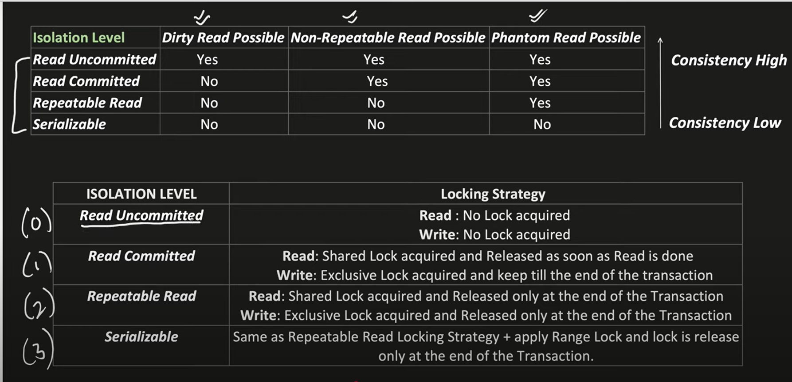

Distributed Concurrency Control 
- https://youtu.be/D3XhDu--uoI
- https://notebook.zohopublic.in/public/notes/u3i1s8441ef17edee467bb020cc6974b3d7f9

synchronized internally uses locking => only 1 thread can enter the CS at a time
synchronized works for multiple threads of the same process
but doesn't work threads from different processes

synchronized cannot help in case of distributed system

1. What is the usage of transaction? - all or none; used for rollback in case all steps in transaction are not completed
2. What is DB locking? TODO: Study from internet. Unclear
   Shared Lock also k/a read lock. A 2nd transaction can read as well
   Exclusive Lock also k/a write lock. A 2nd transaction can neither take shared lock for read nor exclusive lock for write

| LockType          |Another SharedLock |Another ExclusiveLock |
|-------------------|-------------------|----------------------|
| Has Shared Lock   | Yes               | No                   |
| Has Exclusive Lock| No                | No                   |

3. What are the isolation level (IL) present?
- Read Uncommitted
- Read Committed
- Repeatable Read
- Serializable

Dirty Read: Reading uncommitted changes of another transaction
Non-Repeatable Read: Reading same row twice does not give same data
Phantom Read: Reading same query twice returns extra/missing rows, not just data edits

- A phantom read happens when:
   * Transaction A runs a query fetching rows matching a condition
   * Transaction B inserts/deletes rows that match that condition
   * When Transaction A re-runs the same query, it sees more/fewer rows — new "phantom" rows appear or disappear

The arrow is for concurrency and not consistency

Read Uncommitted can be used when we have only read and no write scenarios

Read Commited IL solves Dirty Read problem
Repeatable Read IL solves Non-repeatable, Dirty read problems. Repeatable Read locks rows, but not ranges or query predicates
Serializable IL solves all problems including Phantom Read

Why is the Repeatable Read isolation level not able to prevent the phantom read problem?
- Under Repeatable Read, the database guarantees: "If you read the same row twice, you’ll get the same data"
- It locks the rows you read, so no one can change them while you're still inside the transaction
- It does NOT lock: Rows that don’t yet exist, but match your query condition

For every transaction we can set the IL

Optimistic Concurrency Control (OCC)
- uses IL = Read Committed
- solves concurrency using version
- MySQL has inbuilt row version unlike Oracle
- Exclusive Lock is acquired only when version read == version of Critical Section (CS). If not equal, then value of CS should be read again. If CS is updated by another thread then it also updates the version of the CS 

Pessimistic Concurrency Control (PCC)
- uses IL = Repeatable Read/ Serializable
- Holding shared/exclusive locks until transaction end ensures serialized execution of concurrent transactions (only after completion of 1 transaction can other get started)
- Drawback of PCC: 
* deadlock is possible
   * T1: Read A --> Write B
   * T2: Read B --> Write A
   * Eventually the transactions stuck in deadlock are aborted
* for long running transactions if lock is acquired for long, timeout can occur

OCC has higher concurrency than PCC (as Read Committed has highr concurrency than Repeatable Read/ Serializable)

A popular PCC protocol - 2PL (2 Phase Locking) (https://youtu.be/lceenm34m-w)

Based on which IL fits our requirement we can choose either of OCC/PCC