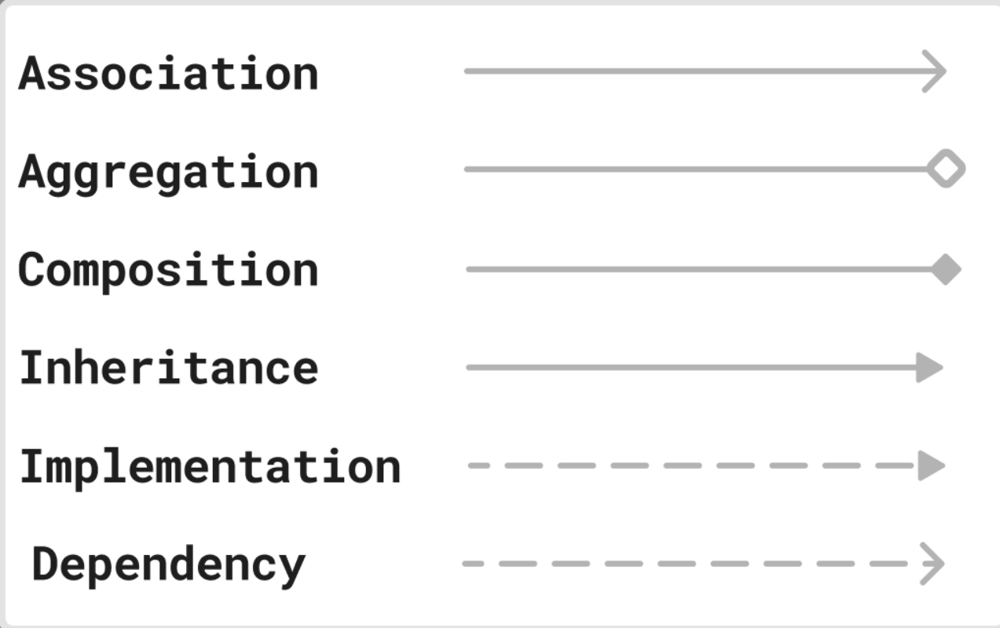

https://youtu.be/XPCG24lEGTo

----------------------------------------------------------------------------------------------------------------------------------------------------------------------

constructor - used to initialize objects with some data for each attribute so that the objects are in a valid state just after their creation

copy constructor - instead of parameters for the constructor, reference of another object is passed as argument

public Movie (Movie other) {
    this.attribute = other.attribute;
}

private constructor - restrict object creation from outside the class. Use case: Singleton design pattern


copy constructor should be utilised for deep copy (shallow copy should be avoided)
d - deep; d - data (copy data and not reference)

Interview questions
1. Can a contructor be?
  a) final - No. constructor is not inherited to subclass anyways, so this discussion is irrelevant
  b) static - No. It's not like there will be one constructor for multiple objects
  c) abstract - No. It's not like constructor should have no implmentation and a subclass must implement its own version of the constructor

2. What happens if you explicitly define a constructor with arguments but no default constructor?
- In that case the default constructor is not provided by Java. If we want we have to declare it explicitly

3. What happens if u create an object of a subclass? Which constructor is called first?
- parent class constructor then subclass constructor --> ensures proper initialisation

4. What happens if a constructor is synchronized?
- compilation error
- Synchronization means no other thread should have simultaneous access. But before the complete execution of constructor the object (`this`) is not evcen created yet. And synchronization works by locking `this`. So having synchronized in constructor is meaningless

5. Can a constructor be inherited?
- No. If we need constructor of parent class from subclass we can call `super`

6. Can a constructor have a return statement? (Tricky)
- Yes
- for early exit; not to return a value. Use case: to prevent initialisation with invalid values

----------------------------------------------------------------------------------------------------------------------------------------------------------------------
`this`

use cases
1. removes ambiguity between instance variables and local variables
2. constructor chaining
3. returning current object - for method chaining as in Builder Design Pattern

`this` is not available in a static methods. Using it in static context throws compilation error

----------------------------------------------------------------------------------------------------------------------------------------------------------------------
Polymorphism

Types
1. Compile time/Static polymorphism - Method overloading
2. Runtime / Dynamic polymorphism - Method overriding

----------------------------------------------------------------------------------------------------------------------------------------------------------------------
Inheritance

Types
1. Single Inheritance
2. Multi level Inheritance
3. Heirarchical Inheritance
```
      A
     / \
    B   C
```
3. Multiple Inheritance
```
    B   C
    \   /
      D
```
- not supported by Java cuz it leads to diamond problem
```
      A (has function f)
     / \
    B   C (B, C are children of A)
    \   /
      D (D is the child of B; D is the child of C)
```

Problem - D.f should call B.f or C.f ? if D does not override f

Solution: Make B and C abstract to force D to implement its own f()

- can implement multiple interfaces but should extend only 1 of the child class of the root class cuz of the possibility of diamond problem

- purpose of inheritance - resuability of code following DRY principle
- disadvantage of inheritance - if parent is changed it might affect all or some of the children (O of SOLID principle - Open for extension; closed or modification)

----------------------------------------------------------------------------------------------------------------------------------------------------------------------
Encapsulation

achieved by 
1) declaring instance variables as private
2) public getter and setter for above instance variables

aim of encapsulation
1) data hiding
2) modularity - separation data (class/instance variables) and behavior (methods)
3) data integrity - instance variables can only be modified through defined methods cuz the former are private

----------------------------------------------------------------------------------------------------------------------------------------------------------------------
Abstraction - exposing only essential details necessary to interact with the object

achieved by
1. abstract class - cannot be instantiated
2. interface

- if the child class of an abstract class does not override all the abstract methods then the child class has to be declared abstract


- interfaces can now since java 8 have default and static methods
- interfaces can now have since java 9 have private methods as well
   * not visible to implementing class
   * use-case: Shared logic for default/static methods
- interfaces can have only static and final field. all fields in an interface are implicitly: public static final

- abstract class have any variable type - final/non-final/static/non-static
- abstract class can have constructors which interface will not have

When to use an interface?
1. When a default implementation is not needed....since java 8 interfaces can have default methods...so this distinction between interfaces and abstract classes no longer valid
2. When we need to have multiple inheritance

When to use abstract class?
1. when need a template for other classes to follow (Template Method Design Pattern - https://github.com/AshuOPragmatikosThrylos/Design-Patterns-Practice/tree/master/15.%20Template%20Method)

Interview questions
1. Difference between interface and abstract class?

| # | Interface                                | Abstract Class                              |
|---|------------------------------------------|---------------------------------------------|
| 1 | Cannot have constructors                 | Can have constructors                       | 
| 2 | All methods are abstract                 | Can have both abstract and concrete methods |
| 3 | Fields are public static final           | no restriction                              |
| 4 | Supports multiple inheritance            | Supports single inheritance only            |
| 5 | data member should be initialised        | no restriction                              |
| 6 | cannot contain instance and static blocks| no restriction                              |

Interface cannot have constructors cuz
  a) can have only static members
  b) constructors cannot initialise static members

- Method in interfaces - public abstract (unless default, static, or private; note not final)
- IMP
   * if its default => not abstract => 2 interfaces with same name/signature default method could cause diamond problem
   * but Java throws compilation error and forces override

2. Can abstract class implement an interface? Usecase?
 - yes
 - to provide partial implementation (not implement all the methods of the interface in the child class)

 - either implement all the methods of an interface/abstract class or make yourself abstract

3. Why can't we instantiate an abstract class? What would be the consequences if it were allowed?
 - Trying to instantiate an abstract class means creating an object with unimplemented methods, leading to undefined or erroneous behavior if called
 - If an abstract method is called, the program would crash due to missing implementation

 - an abstract class can have no abstract methods; but
 - if a class has even 1 abstract method, the class has to be declared abstract

4. Limitations of abstract class over interface?
 - multiple inheritance cannot be achieved with abstract classes

 | Scenario                                     | Allowed? | Why?                                     |
| -------------------------------------------- | -------- | ---------------------------------------- |
| Two interfaces with **same abstract method** | ✅ Yes    | One method implementation satisfies both |
| Two interfaces with **default method**       | ❌ No     | Conflict — must override                 |
| One interface, one class with same method    | ✅ Yes    | Class wins in method resolution          |


5. When not to use interface?
 - when implementing classes share common state. data members in interface have many restrictions - Always public static final

6. Why were default methods in interfaces introduced?
 - to allow adding new methods without breaking existing implementations

7. Can a class implement an interface without overriding its default method? Yes. Infact that was the idea behind introducing them

8. IMP: What happens if a class implements an interface with a default method and also inherits the same method from a superclass? Which one gets priority if any?
 - method from superclass

9. 
 - default methods in interfaces cannot have instance variables because interfaces cannot hold object-specific (instance) state
 - Interfaces cannot have non-constant (i.e., non-public static final) variables

- int x;                   // ❌ Error: must be initialized
- private int y = 5;       // ❌ Error: interfaces cannot have private variables; though can have private methods
- protected String name;   // ❌ Error
- int z = 10;              // ✅ But it's implicitly public static final

----------------------------------------------------------------------------------------------------------------------------------------------------------------------
Access modifiers

- protected - anywhere from same package; only from subclass if outside the package
- default - package-private

IMP: note the diff

----------------------------------------------------------------------------------------------------------------------------------------------------------------------
2:10:50 - Class diagram 
- https://youtu.be/XPCG24lEGTo?list=PLpxM6m39X_t-Rk9lZVVD4U6JycAAIIEDW&t=7850
- https://blog.algomaster.io/p/uml-class-diagram-explained-with-examples
- Note: The direction of the association arrow is opposite to that of the others



Relationship types

Diff b/w association and aggregation
- association
 * friendship; no ownership implied
- aggregation
 * has-a relationship
 * whole contain reference of part
 * parts can exist independently of the whole. Ex: Team, Players

Diff b/w aggregation and composition
- composition 
 * aggregation with full ownership
 * if whole is destroyed, parts cannot exist independently. Ex: House, rooms (Room object does not exist outside the context of the house)


Dependency 
 - transient/temporary relationship and exist only during method call
 - Ex: Document uses Printer during - printDocument(printer: Printer): void


Diff b/w Association and Dependency
 - Association - instance variable; long term relationship
 - Dependency - method parameter; short term temporary relationship


Realisation - class implements interface


Composition, Aggregation are not important and could be confusing

----------------------------------------------------------------------------------------------------------------------------------------------------------------------
Generics

```
class Test <T, U> {
  T objT;
  U objU;

  Test (T objT, U objU) {
    this.objT = objT;
    this.objU = objU;
  }

  // code
}

Main {
    main () {
      Test<Integer, String> obj = new Test<Integer, String> (15, "someString");
    }
}
```


- Generics don't work with primitive types but only for reference types. can't use int but can use int[]
- Benefit of generics: Generics eliminate the possibility of typecasting errors at run time

```
  class MyArrayList<T> {
    private Object[] elements;

    // member functions
  }

  MyArrayList list1 = new MyArrayList();
  list1.add("Sachin");
  list1.add("Rahul");
  list1.add(10); // Compiler allows this because 10 gets autoboxed into an Integer, and the list can hold any Object due to being raw
  String s1 = (String) list1.get(0);
  String s2 = (String) list1.get(1);
  String s3 = (String) list1.get(2); // runtime exception - ClassCastException


  MyArrayList<String> list2 = new MyArrayList<String>();
  list2.add("Sachin");
  list2.add("Rahul");
  list2.add(10); // compile time error
```

----------------------------------------------------------------------------------------------------------------------------------------------------------------------
Wildcards (Tricky)

? symbol used in generics to represent unknown type

## Types of Wildcards

| Wildcard        | Meaning                          | Use Case | Can Add?   | Can Read As    |
| --------------- | -------------------------------- | -------- | -----------|--------------- |
| `<?>`           | Unbounded (any type)             | Neutral  | ❌ No     | ✅ Object      |
| `<? extends T>` | Upper-bounded (T & subclasses)   | Producer | ❌ No     | ✅ T           |
| `<? super T>`   | Lower-bounded (T & superclasses) | Consumer | ✅ T      | ❌ Only Object |

- by superclasses we mean - the 1 direct superclass and its ancestors
- Wildcards do not allow additions usually because the compiler cannot guarantee type safety for the unknown type

---

```java
class Fruit {}
class Apple extends Fruit {}
class Banana extends Fruit {}

List<Fruit> fruitBasket;
List<Apple> appleBasket;
List<Banana> bananaBasket;
```

---

## 1️⃣ Unbounded Wildcard `<?>`

```java
public void printBasket(List<?> basket) {
    for (Object item : basket) {
        System.out.println(item);  // ✅ Can read as Object
    }
    // basket.add(new Apple()); ❌ Can't add anything (except null)
}
```

- Accepts: `List<Apple>`, `List<Banana>`, or `List<Fruit>`
- Cannot add anything — because we don’t know the exact type

---

## 2️⃣ Upper-Bounded Wildcard `<? extends Fruit>` – **Producer (read)**

```java
public void eatAll(List<? extends Fruit> basket) {
    for (Fruit f : basket) {
        System.out.println("Eating " + f);  // ✅ Safe to read as Fruit
    }
    // basket.add(new Apple()); ❌ Still can't add anything (except null)
}
```

- Accepts: `List<Apple>`, `List<Banana>`, or `List<Fruit>`
- Cannot add `new Apple()` or `new Banana()` (compiler doesn't know the exact subtype)

---

## 3️⃣ Lower-Bounded Wildcard `<? super Apple>` – **Consumer (write)**

```java
public void addApple(List<? super Apple> basket) {
    basket.add(new Apple());  // ✅ Safe to add Apple or its subclasses
    // Fruit f = basket.get(0); ❌ Can't read as Apple or Fruit; only Object
}
```

- Accepts: `List<Apple>` and `List<Fruit>` and even `List<Object>`
- Does not accept: `List<Banana>`

---

## 💡 PECS Rule

> **Producer Extends, Consumer Super**

| Goal  | Use         | Reads As | Writes |
| ----- | ----------- | -------- | ------ |
| Read  | `? extends` | ✅ T      | ❌ No   |
| Write | `? super`   | ❌ Object | ✅ T    |

---

Generic vs Wildcards

| Feature             | Generics (`<T>`)                  | Wildcards (`<?>`)                             |
| ------------------- | --------------------------------- | --------------------------------------------- |
| **Type Usage**      | You define/use a specific type    | You use unknown/limited types                 |
| **Type Flexibility**| Less flexible — fixed type        | More flexible — supports type ranges          |
| **Declaration**     | Used in class/method declarations | Used in method **calls/parameters**           |
| **Read/Write**      | You can safely read/write         | Read or write depends on bounds               |


Quick Rule of Thumb:
- Use Generics when you define a class/method and want it to work for different types. But once type is decided at the time of declaration then the whole generic class works for only that type
- Use Wildcards when you call a method or accept parameters and want flexibility over type bounds